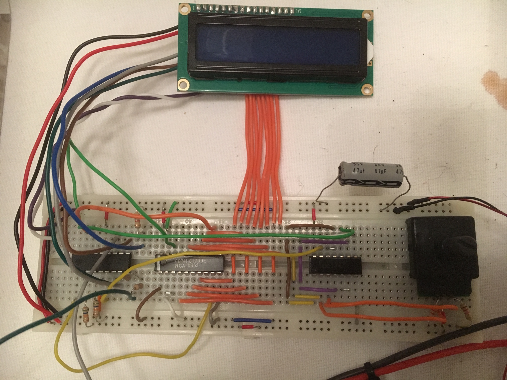

# dc-motor-steering-using-pic16F648A
Showing you an exciting project with motor steering. I've included code for a DC motor steering with a PI-regulator algorithm and rpm conversion that are sent to a LCD-display showing the RPM in real time. The rpm setting can be adjusted through a rotary pulse encoder. This example application is a typical example of what kind of fun and powerful embedded hardware you can create with the 4k 16F648A processor.

In this application I'm using three really cool features of the processor namely interrupt capability, PWM-encoding for the DC-motor steering signal and counters using external pins for measuring the rpm. So basically more or less the processor is capable of doing the job of both measuring the rpm, display the value and produce a steer signal for the DC-motor just using it's internal and configurable features.

I shortly will publish the pin configuration for you if you like to test this on an experimental board.

The processor spec can be read here: http://ww1.microchip.com/downloads/en/DeviceDoc/40044G.pdf

And the display spec can be read from here: https://www.sparkfun.com/datasheets/LCD/HD44780.pdf

